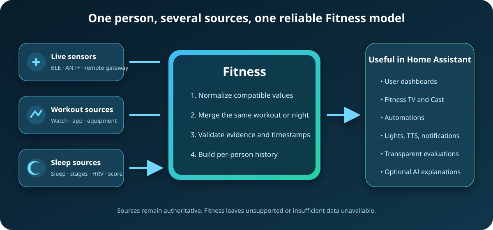

<picture>
  <source media="(prefers-color-scheme: dark)" srcset="assets/fitness-logo-dark.png">
  
</picture>

### Your fitness data. One place. Your Home Assistant.

**Bring workouts, live sensors, sleep and recovery together — then make them useful.**

[Who it is for](#who-fitness-is-for) · [Features](#what-fitness-does) · [Hardware](#what-you-need) · [Supported sources](#supported-sources-and-sensors) · [Workout calendar](docs/WORKOUT_CALENDAR.md) · [Setup](#getting-started) · [FAQ](#questions--answers) · [Science](docs/SCIENCE.md) · [Changelog](CHANGELOG.md)

## TL;DR

Fitness is a person-centered custom integration for Home Assistant. It takes compatible fitness data that is **already available in Home Assistant**, normalizes it, reconciles duplicate views of the same workout, builds personal history and exposes useful live, workout, recovery and evaluation entities.

Your watch, chest strap, ANT+ sensor, sleep integration or workout provider remains the source. Fitness is the layer that helps those sources work **together**.
For example, **HA-ANT-Plus** can supply live heart rate, speed, cadence or power while another integration later contributes the completed workout.

**The calculations are deterministic. AI is only an interpretation layer.** Scientific metrics, formulas, workout merging, readiness components, RPE load and other deterministic results are **never generated by AI**. AI may explain already-calculated evidence or provide coaching when enabled.

Start with **[who Fitness is for](#who-fitness-is-for)**, check **[what hardware you need](#what-you-need)** and the **[supported sources and sensors](#supported-sources-and-sensors)**, then follow **[Getting started](#getting-started)**. Details live in the [feature guide](docs/FEATURES.md), [workout calendar guide](docs/WORKOUT_CALENDAR.md), [remote-access guide](docs/REMOTE_ACCESS.md), [remote gateway protocol](docs/REMOTE_GATEWAY_PROTOCOL.md), [local Garmin guide](docs/GARMIN_LOCAL.md), [direct device health history](docs/DIRECT_DEVICE_HISTORY.md), [FAQ](docs/FAQ.md), and [science documentation](docs/SCIENCE.md).

> **Health notice:** Fitness is a training, wellness, visualization and automation tool—not a medical device. Measurements and estimates can be missing, delayed or wrong. Never use the dashboard to diagnose a condition or decide whether exercise is medically safe; see the full [health and safety disclaimer](#science-evidence--an-important-boundary).

## Who Fitness is for

Fitness is designed for people and households that already use **[Home Assistant](https://www.home-assistant.io/)** and want a person-centered view across more than one sensor, wearable, workout app or sleep source. It is especially useful when you want to:

- combine a live chest strap, foot pod, bike sensor or fitness machine with a completed workout uploaded later by a watch or app;
- keep one canonical workout instead of unrelated provider duplicates;
- give each household member a separate dashboard, history, sensor assignment and Fitness TV profile;
- use fitness state in [Home Assistant automations](https://www.home-assistant.io/docs/automation/), lights, notifications and TTS;
- see transparent readiness, recovery and training context only when enough evidence exists.

Fitness is not a replacement for your wearable's source integration, a clinical monitoring system, or a useful install when none of your fitness data reaches Home Assistant. Read [What Fitness does](#what-fitness-does) and [Questions & answers](#questions--answers) for those boundaries.

## What you need

Only the first row is always required. Add the optional hardware for the features you want.

| Purpose | Required hardware or service | Notes |
| --- | --- | --- |
| **Core** | A supported Home Assistant installation and at least one compatible workout, sleep or live-data entity | Fitness reads data already exposed to Home Assistant. Browse the [Home Assistant integration directory](https://www.home-assistant.io/integrations/) and see [Getting started](#getting-started). |
| **Local Bluetooth live sensors** | A Bluetooth adapter or Bluetooth proxy reachable by Home Assistant | Standard BLE fitness services are decoded by Fitness. See the [Home Assistant Bluetooth documentation](https://www.home-assistant.io/integrations/bluetooth/) and [supported live sensors](#live-sensor-protocols). |
| **CYCPLUS M1 workout import** | A CYCPLUS M1 powered on and within range of a connectable Home Assistant Bluetooth adapter or proxy | Fitness connects locally, downloads completed FIT files and imports them into each assigned profile. No CYCPLUS cloud account is used. See [CYCPLUS M1 workout archive](docs/LIVE_SENSORS.md#cycplus-m1-workout-archive). |
| **Local Garmin workout import** | A compatible Garmin GFDI device and a connectable Home Assistant Bluetooth route | Fitness recognizes Garmin vendor/protocol evidence, selects transport from the connected GATT capabilities, reads completed FIT activities locally in short bounded sessions and disconnects again. The Bluetooth name/model is never used for protocol selection; first-time bonding is requested automatically through Home Assistant Bluetooth, the phone is not required, and Garmin Connect can remain paired. See [Local Garmin workout synchronization](docs/GARMIN_LOCAL.md). |
| **Local ANT+ live sensors** | A Dynastream/Garmin ANTUSB2 (`0FCF:1008`) or ANTUSB-m (`0FCF:1009`) stick attached to the Home Assistant host | ANT+ support is optional. Containers must expose the USB device to Home Assistant. |
| **Remote browser sensors** | A laptop or compatible mobile device beside the athlete, HTTPS access to Home Assistant, and browser support for Web Bluetooth or WebUSB | Browser support varies. Check [Web Bluetooth](https://developer.mozilla.org/en-US/docs/Web/API/Web_Bluetooth_API), [WebUSB](https://developer.mozilla.org/en-US/docs/Web/API/WebUSB_API), and the [remote gateway guide](docs/REMOTE_GATEWAY_PROTOCOL.md). |
| **Fitness TV / Cast** | A browser display or a Google Cast display visible to Home Assistant or the local sender | See [Fitness TV dashboard](#fitness-tv-dashboard) and Home Assistant's [Google Cast documentation](https://www.home-assistant.io/integrations/cast/). |
| **Music, speech and feedback** | Browser/display audio; optionally a Home Assistant TTS provider, Music Assistant, speakers or compatible lights | These are optional and configured per profile. See [Fitness TV dashboard](#fitness-tv-dashboard) and [features](docs/FEATURES.md). |

## Supported sources and sensors

Support is capability-based: a named adapter understands a known provider layout, while conservative generic discovery can use other clearly identified Home Assistant entities. A provider name below means Fitness can normalize data that its Home Assistant integration exposes; it does not mean Fitness logs into that provider directly.

| Data category | Dedicated support | More information |
| --- | --- | --- |
| **Completed workouts** | Garmin, Polar, Strava, Suunto, Fitbit, Oura, WHOOP, Withings, Peloton, Hevy and HealthSync/Apple Health, plus a conservative generic adapter | [Completed workouts and merging](docs/FEATURES.md#completed-workouts-and-merging) and [workout calendar](docs/WORKOUT_CALENDAR.md) |
| **Direct device workout archives** | CYCPLUS M1 and compatible Garmin GFDI devices over local Bluetooth | [CYCPLUS M1 workout archive](docs/LIVE_SENSORS.md#cycplus-m1-workout-archive), [local Garmin guide](docs/GARMIN_LOCAL.md), and [workout calendar](docs/WORKOUT_CALENDAR.md) |
| **Direct device health history** | Ultrahuman Ring AIR, MyKronoz ZeTime, HPlus-protocol wearables, Bangle.js and Xiaomi Mi/Smart Band 1–7 over local Bluetooth; Smart Band 10/10 Pro can use standard BLE heart-rate broadcast | [Direct device health history](docs/DIRECT_DEVICE_HISTORY.md) |
| **Sleep and recovery** | Garmin, Oura, Fitbit, HealthSync/Apple Health, Withings, WHOOP, Suunto, SleepIQ, Eight Sleep and Sleep as Android | [Recovery and readiness](docs/FEATURES.md#recovery-and-readiness), [FAQ](docs/FAQ.md), and [science](docs/SCIENCE.md) |
| **Live Bluetooth** | Bluetooth SIG Heart Rate, Cycling Power, Cycling Speed and Cadence, Running Speed and Cadence, and FTMS Indoor Bike/Treadmill measurements | [Live sensor protocols](#live-sensor-protocols), [Bluetooth setup](https://www.home-assistant.io/integrations/bluetooth/), and [remote gateways](docs/REMOTE_GATEWAY_PROTOCOL.md) |
| **Live ANT+** | Heart rate, cycling power, bike speed, bike cadence, combined speed/cadence, stride speed/distance and fitness-equipment profiles | [Live sensor protocols](#live-sensor-protocols) and [remote gateways](docs/REMOTE_GATEWAY_PROTOCOL.md) |
| **Music** | Built-in Radio Browser, direct HTTP(S) audio, normal YouTube/YouTube Music and SoundCloud links, optional yt-dlp, Home Assistant Media Sources and one aggregate Music Assistant adapter | [Fitness TV dashboard](#fitness-tv-dashboard) |

### Live sensor protocols

Fitness supports standards rather than a closed model list. A standards-compliant sensor can work when it exposes the required BLE service/characteristic or ANT+ device profile and provides valid measurements. Current live metrics include heart rate, power, cadence, speed, pace, distance and supported fitness-machine fields. Stryd has explicit BLE/ANT+ cross-transport identity matching so its local, browser and Home Assistant observations can be merged as one physical sensor; compatible Garmin wearable heart-rate broadcasts also have explicit cross-transport correlation rules.

A physical sensor may be assigned to more than one Fitness profile, but during overlapping live sessions Fitness grants it to one workout owner at a time. For remote pairing, the authenticated profile that adds the sensor is added to that sensor's profile assignments. See the [feature guide](docs/FEATURES.md#live-workout) and [remote gateway protocol](docs/REMOTE_GATEWAY_PROTOCOL.md).

Household **weight scales are intentionally shareable**. Each Fitness profile keeps an editable current/manual weight and may select the same Home Assistant scale entity as other profiles. After a fresh scale reading Fitness suggests the closest matching profile but does not silently attribute the measurement: the user's dashboard asks for confirmation and provides a profile dropdown plus Ignore. See [Shared household scales](docs/FEATURES.md#shared-household-scales).

The **CYCPLUS M1** is a completed-workout archive source rather than a live measurement source. Once added and assigned, Fitness automatically reconnects when the device is reachable, validates each FIT file, checkpoints completed files and imports the workouts into the assigned profiles' canonical calendars. Interrupted transfers restart only the unfinished file because the M1 protocol has no safe byte-offset command.

Compatible **Garmin GFDI devices** can also act as direct local workout archives. Fitness auto-discovers candidates from Garmin vendor/protocol evidence (not the Bluetooth model name), dynamically discovers V2 Multi-Link channels, and negotiates bounded V2 -> V1 -> V0 fallbacks from the connected GATT capabilities. It automatically requests first-time Bluetooth pairing when needed, then downloads only unseen activity FIT files, checkpoints them locally and disconnects. If the Garmin shows a confirmation/code, the user only approves it on the device. Garmin files are never marked synced, archived or deleted by Fitness. See the [local Garmin guide](docs/GARMIN_LOCAL.md) for pairing, discovery, safety limits and compatibility details.

## What Fitness does

| Area | In practice |
| --- | --- |
| 🏃 **Live workout** | Combines compatible live heart rate, speed, pace, cadence, power, distance and other measurements into one session. Native ANT+/Bluetooth sensors may be assigned to several profiles for reuse, but each physical sensor is exclusively locked to one workout owner during overlapping sessions so one person's measurements cannot feed another person's workout. |
| 🧩 **Workout merging** | Reconciles live capture and later provider uploads so one physical workout does not have to become several unrelated workouts. |
| 📅 **Workout calendar & history** | Stores canonical completed workouts, backfills compatible provider/Recorder history, enriches existing workouts when another source adds data, and exposes one Home Assistant calendar event per physical workout. Retention is configurable per profile. |
| 😮‍💨 **Recovery & readiness** | Uses available sleep, personal HRV/RHR context, recent training and HR recovery to describe readiness and estimate when you may be ready for another workout. |
| 📈 **Training evaluation** | Builds personal trends for training load, adaptation, cardiorespiratory fitness and comparable workouts as enough history becomes available. |
| 😴 **Sleep** | Merges compatible sleep sources conservatively, deduplicates nights and exposes sleep stages, score, HRV and rolling sleep context when available. |
| 💪 **RPE & strength** | Supports session RPE/load and optional detailed strength analysis such as sets, volume, estimated 1RM and progression. |
| 🏠 **Home Assistant** | Uses normal HA entities, so your workout can drive dashboards, lights, fans, notifications, TTS and automations. |
| 🤖 **Optional coaching** | AI or deterministic localized TTS can explain existing workout/recovery evidence without becoming the measurement engine. |

Fitness is **capability-aware**: if the selected sources do not provide enough evidence for a feature, Fitness leaves it unavailable instead of manufacturing a number.

## How it fits together

Fitness does not replace the source integrations. It gives their compatible data a common Home Assistant model.

## Fitness dashboard

Fitness includes modern **Community dashboards** and bundled cards for **Live workout, Workouts, Recovery & Sleep, and Evaluation**. The cards resolve normalized Fitness entities, so the frontend does not need to know which provider originally supplied a compatible value.

The frontend resource is normally registered automatically. If you ever need the manual troubleshooting fallback, add `/fitness/frontend/fitness-dashboard.js` as a JavaScript module resource in Home Assistant. Workout-route views appear only when the current merged workout has valid matching GPS/route data.

### Fitness TV dashboard

Fitness can optionally create a hidden, full-screen **Fitness TV** dashboard and show the correct profile through Home Assistant Cast when a workout starts. Each Fitness profile keeps its own selected TV cards. The TV dashboard also includes music play/pause and a Home Assistant Media Source browser. Music and TTS are played inside the dashboard browser itself; during a Fitness announcement the music is smoothly ducked to the configured percentage and restored after speech finishes. This keeps the Lovelace dashboard loaded instead of deliberately replacing it with a separate Cast media receiver. **Browser Mod is not required**; the browser-audio bridge is bundled with Fitness.

Enable it in the Fitness setup/options under **Fitness TV dashboard**, select the Cast TV, and choose the TTS ducking level. The hidden dashboard remains available at `/fitness-tv/main` for configuration/troubleshooting, while automatic casting uses a profile-specific full-screen view so multi-user installations open the correct Fitness profile.

Fitness TV music is capability-based and each adapter lives in its own module under `custom_components/fitness/music/`. The active list contains only adapters that are actually installed/usable; unrelated Home Assistant Media Sources are never presented as music providers. Built-in **Radio Browser**, the optional **yt-dlp** adapter and **Music Assistant** (one aggregate adapter) can be enabled independently for each Fitness profile. yt-dlp is enabled only from **Music Providers**, where its legal acknowledgement is shown. **Search music** can target one, several, or all enabled adapters that genuinely support search; when Music Assistant is selected, its configured music-provider instances are exposed as nested search scopes so the user can search one, several, or all currently available MA sources. The result count is profile-configurable from 10–100 (default 50).

### Fitness TV accounts and remote profiles

Fitness TV has three access roles: a **local Fitness administrator**, **local users**, and **remote users**. Local/remote users are bound by the administrator to exactly one Fitness backend profile and the server enforces that boundary for dashboard data, workout actions, music, Cast, TTS and remote BLE/ANT+ gateway traffic. Users cannot enroll themselves or browse other Fitness accounts.

Remote accounts use one logical subdomain per user. Configure wildcard DNS/TLS once (for example `*.fitness.example.com`), then Fitness creates/manages the slug and direct profile URL. Removing an account immediately revokes its Fitness access even though the wildcard DNS name may still resolve. See [Fitness TV accounts and remote access](docs/REMOTE_ACCESS.md) for the security model and setup details.

Music/account settings are split deliberately: Fitness persists only profile-specific choices (enabled adapters, result count and adapter account/server selection metadata), while passwords, OAuth tokens and provider subscriptions stay with Home Assistant or Music Assistant. Music Assistant remains a **single Fitness adapter** even when it has Spotify, Apple Music, Tidal, Qobuz, Deezer, SoundCloud, YouTube Music or other Music Assistant sources configured. Its configured provider instances appear only as nested search scopes. Fitness suppresses a provider/account instance from the search selector when Music Assistant reports another playing queue using it, and also treats matching Home Assistant `media_player` integrations that are currently `playing` as externally busy. This is intentionally conservative: services that expose no account/session activity cannot be reliably detected until that provider offers such state. The Fitness **Add music provider** view offers setup shortcuts but those source accounts do not become duplicate adapter rows.

For **Music Assistant**, provider setup is routed to the selected Music Assistant server itself rather than to Home Assistant's Music Assistant integration page. This matters especially for Home Assistant Container, where the HA integration only connects MA server instances. Fitness reads the configured MA server URL: the aggregate Music Assistant action opens `/#/music`, unconfigured music providers use `/#/settings/addprovider/<provider-domain>`, and a configured provider instance can use `/#/settings/editprovider/<instance-id>`. The provider catalogue is queried from the connected MA server rather than being treated as a fixed Fitness list. Search/playback does **not** open those web pages: supported MA search results play natively inside Fitness TV through an official Sendspin browser player. Fitness relays the Sendspin WebSocket through the authenticated Home Assistant origin so remote HTTPS Fitness TV clients can use the selected local MA server without mixed-content or direct-LAN reachability problems. On Home Assistant OS/Supervisor, the official MA integration may expose the server through authenticated ingress instead of a browser-reachable container URL, so Fitness uses the supported ingress path when necessary.

Fitness intentionally does **not** wholesale vendor every implementation from Music Assistant's provider directory. Music Assistant server code is Apache-2.0, which permits reuse subject to that license, but that code license does not grant rights to third-party service APIs, trademarks, subscriptions, authentication methods, media catalogues or service terms. In addition, many MA providers depend on Music Assistant's own provider lifecycle, configuration/authentication flows and streaming pipeline. Native Fitness adapters are therefore added provider-by-provider only when the service/protocol is technically maintainable and its use is appropriate; otherwise the supported path is the single Music Assistant adapter.

The **yt-dlp adapter** is disabled by default and requires an explicit legal acknowledgement. Its search result limit follows the per-profile Fitness TV setting, and only results selected from that adapter are resolved to proxied audio. Normal YouTube/YouTube Music URLs entered through **Play from link** use the normal YouTube player instead of yt-dlp; direct HTTP(S) audio and SoundCloud links are also supported there, while unsupported account-only links such as Spotify are intentionally rejected from the link field. Fitness declares the yt-dlp default Python extras plus a pinned Node.js runtime distributed as a Python requirement; an existing supported host Deno/Node/QuickJS/Bun runtime is preferred when available. Radio Browser countries are displayed in localized alphabetical order.

### Remote Fitness TV clients, local Cast and sensor gateways

Fitness TV can now act as a **remote sensor gateway** when the athlete is on a different network from Home Assistant. A remote laptop or supported mobile browser opens the normal authenticated Fitness TV profile over HTTPS, pairs sensors located beside that athlete, and sends their raw radio measurements back to HA-Fitness. Home Assistant remains the central owner of profile assignment, live workout capture, decoding and history.

- **Bluetooth:** the browser uses Web Bluetooth for standard Heart Rate, Cycling Power, Cycling Speed/Cadence, Running Speed/Cadence and FTMS measurements. The picker does not require those UUIDs to be present in the advertisement: Fitness lets the user select a nearby BLE device, connects, then validates the actual GATT services and rejects unsupported devices. This also catches sleeping/vendor-advertising sensors that expose standard fitness profiles only after connection. Previously authorized devices can be reconnected without selecting them from scratch.
- **ANT+:** an experimental WebUSB gateway supports Dynastream/Garmin ANTUSB2 (`0FCF:1008`) and ANTUSB-m (`0FCF:1009`) sticks. The browser handles ANT serial framing/scanning and forwards extended ANT channel identity plus the raw eight-byte payload into Fitness's existing remote ANT+ worker and decoders.
- **Local Google Cast:** the Cast menu distinguishes TVs visible to the Home Assistant server from **Local network TV**. Local Cast uses the browser's Google Cast Web Sender session, so a remote athlete can choose a Cast TV on their own Wi-Fi even while HA is elsewhere. The receiver reuses the currently logged-in HA browser session's refresh token and matching client ID (preserving that user's HA permissions) and requires an externally reachable HTTPS HA URL; Fitness never revokes that browser token when Cast stops.

Browser Bluetooth/USB access is permission-gated and browser-dependent. The protocol is intentionally transport-neutral so future Android, iOS and Windows Fitness sender apps can use native BLE/ANT+ APIs while publishing the same gateway messages. See [`docs/REMOTE_GATEWAY_PROTOCOL.md`](docs/REMOTE_GATEWAY_PROTOCOL.md).

## Getting started

1. Install **Fitness** through HACS as a custom repository, or copy `custom_components/fitness/` into your Home Assistant configuration.
2. Restart Home Assistant.
3. Open **Settings → Devices & services → Add integration → Fitness**.
4. Create your profile, choose how long canonical workout history should be retained, and select the Home Assistant devices/entities that provide your workout, live and recovery data.
5. Optionally configure coaching, speakers, notifications and light feedback.
6. Add the bundled Fitness dashboard/cards — and train.

The bundled frontend resource is normally registered automatically. Advanced/manual card configuration remains available, but the normal workflow is designed around selecting a Fitness profile and letting the cards resolve the appropriate entities.

## Questions & answers

### Why install Fitness if my watch integration already works?

Because they solve different problems. Your Garmin, Polar, Oura, WHOOP, Strava, HealthSync or other integration exposes what **that source** knows. Fitness adds the provider-independent layer on top. A chest strap can provide live HR, another device can provide power, and a watch can upload the completed workout later; Fitness can reconcile those views while retaining Fitness-owned RPE, HR recovery and personal-history context.

### Does Fitness replace Garmin Connect, Strava, Polar, Hevy, HealthSync, etc.?

No. Keep the source integration. Fitness reads compatible Home Assistant entities from it. Dedicated adapters understand known provider layouts, while conservative fallback parsing can work with other integrations that expose sufficiently clear workout or sleep data.

### Why are some entities missing?

Because missing data stays missing. Fitness creates or materializes features only when their prerequisites are available. As your history grows, additional evaluation and baseline features can become meaningful.

### What is Training Readiness?

A transparent **Fitness-owned** 0–100 composite of the independent recovery domains currently available — such as autonomic recovery, sleep, recent training recovery and post-exercise HR recovery. Missing domains are omitted and the remaining weights are renormalized. It is not copied from a wearable vendor and it is not a medical score.

### Is “ready for the next workout” the same thing as Training Readiness?

No. They are related but answer different questions. **Training Readiness** describes your overall current recovery context. **Ready for the next workout** estimates how much recovery time remains after the latest workout. Keeping them separate makes their assumptions inspectable; the Recovery dashboard presents them together because both help answer the practical question: *how recovered do I look right now?*

### What is RPE and why enter it?

RPE is your 1–10 rating of how hard the whole session felt. Fitness can use provider-supplied session RPE when it is genuinely available or let you enter/correct it yourself. Session-RPE load combines perceived effort with duration and complements sensor-derived load rather than replacing it.

### Why does Fitness compare me with myself?

Because many fitness signals depend on the person, protocol, sport and device. Where appropriate, Fitness prefers validated personal history and comparable workouts over simplistic universal good/bad thresholds.

### How long are workouts stored?

Canonical workout history is retained per Fitness profile. The default is **3650 days (10 years)**, which gives long-term analysis plenty of history without making an unbounded JSON store the default. Set retention to **0 days** in the Fitness options to keep canonical workouts indefinitely. Automatic retention removes only Fitness's stored copy; if you later increase retention and a provider still exposes an older workout, Fitness may import it again.

Individual calendar events can be deleted from Home Assistant. For bulk cleanup, the `fitness.delete_workouts_before` action permanently removes workouts older than the requested number of days from that Fitness profile and records one cutoff so provider/history synchronization cannot recreate them.

### Does Fitness use AI to calculate my metrics?

**No.** Normalization, workout merging, history validation, HR recovery, RPE load, readiness components and other deterministic calculations do not depend on AI. Optional AI receives curated results *after* those calculations and can turn them into natural-language coaching or summaries.

### What can I automate with it?

Anything Home Assistant can automate. Change lights with workout intensity, start a fan when training begins, announce progress, build wall dashboards, notify when a workout is complete, or use Fitness entities in your own automations.

### Is my fitness data sent to a Fitness cloud?

Fitness itself works inside your Home Assistant instance from the entities you select and does not require a separate Fitness cloud account. Your source integrations and any optional AI/TTS services have their own data/privacy behavior, so review those separately.

### Is Fitness a medical device or health advisor?

**No. Fitness is not a medical device or health advisor.** It is a training/wellness overview and automation tool. It can summarize measurements and apply documented calculations or evidence-informed heuristics, but it cannot determine whether you are medically safe to exercise, diagnose a condition, prescribe treatment or replace a qualified healthcare professional.

More questions are covered in **[FAQ](docs/FAQ.md)**.

## Science, evidence & an important boundary

Fitness tries to be serious about evidence **without pretending that a dashboard is a doctor**.

The integration deliberately distinguishes between raw/provider measurements, established calculations, personal statistical context and **Fitness-owned interpretations**. Where a method has a scientific basis, the relevant formula, inputs, provenance and/or references are kept inspectable. Composite features such as Training Readiness, training adaptation and estimated recovery time are transparent Fitness models informed by research; they are **not clinically validated diagnostic instruments** simply because their component ideas appear in scientific literature.

The complete methodology and bibliography — including session RPE, HR recovery, HRV, sleep, readiness, training adaptation and estimated recovery — live in **[Science & methods](docs/SCIENCE.md)**.

> **Health & safety disclaimer:** Fitness is provided for informational, fitness, training, wellness and Home Assistant automation purposes only. Outputs are estimates and summaries derived from the data available to the integration and may be incomplete, delayed, inaccurate or inappropriate for an individual situation. Do not use Fitness to diagnose, treat, prevent or monitor disease or injury, to determine medical fitness for exercise, or as a substitute for professional medical advice. If you have symptoms, a medical condition, an injury, concerns about exercise safety, or need an individualized training/health decision, seek an appropriately qualified professional. In an emergency, use your local emergency services.

## Privacy, third parties & legal

- **Local integration:** Fitness processes the Home Assistant entities you configure. It does not require a separate Fitness cloud service.
- **Third-party sources:** Data supplied by wearable, workout, map, AI, TTS or other integrations/services remains subject to those projects' own terms, privacy practices, availability and accuracy.
- **OpenStreetMap:** Workout-route views may use OpenStreetMap map tiles when valid route data is available. Route data is inherently location-sensitive; consider that when choosing where dashboards are displayed or shared.
- **No affiliation:** Fitness is an independent community project. References to third-party products or integrations describe interoperability and do not imply endorsement, certification or affiliation unless explicitly stated otherwise.
- **No warranty:** The software is provided under the MIT License on an “AS IS” basis, without warranty. See **[LICENSE](LICENSE)** for the actual license terms.
- **Custom integration:** Fitness is a community custom integration rather than an official Home Assistant Core integration. Home Assistant documents custom integrations as community-maintained software outside the official Home Assistant release and support process. See the [Home Assistant integration quality documentation](https://developers.home-assistant.io/docs/core/integration-quality-scale/).

## Documentation

**[Features & data flow](docs/FEATURES.md)** explains adapters, live workouts, merging, recovery, strength, dashboards and coaching. **[FAQ](docs/FAQ.md)** contains the longer Q&A. **[Science & methods](docs/SCIENCE.md)** contains the research basis, formulas and interpretation boundaries. **[Changelog](CHANGELOG.md)** contains the unreleased development history and, after the first publication, release notes.

## License

Fitness is distributed under the **[MIT License](LICENSE)**.

---

### Train. Measure. Automate. Understand.

**Your devices collect the pieces. Fitness helps Home Assistant put them together.**

### Smart workout devices

Local workout-storage hardware is managed as one physical device with merged live/archive capabilities and a single stored-workout owner. See [`docs/SMART_WORKOUT_DEVICES.md`](docs/SMART_WORKOUT_DEVICES.md).
