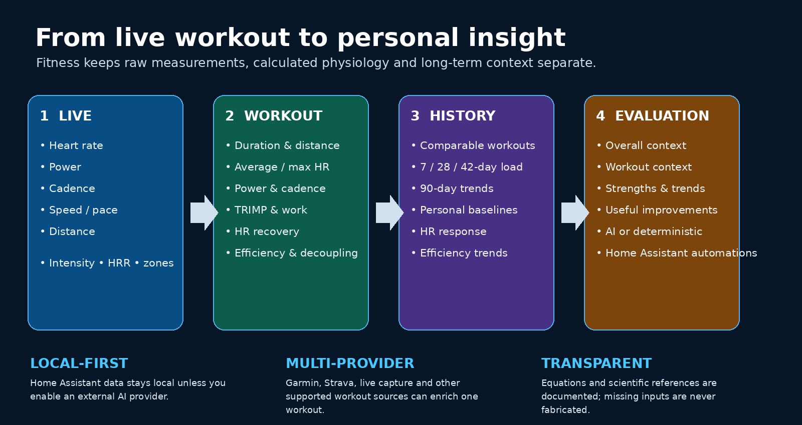

<div align="center">


## TL;DR

**Fitness turns Home Assistant into a local fitness hub for each person.** It can
combine live measurements from several sensors, import completed workouts from
supported integrations, calculate scientifically defined training metrics,
compare workouts with personal history, and optionally provide spoken AI
coaching.

The important distinction is that **AI is only an interpretation layer**.
Measurements, workout merging, unit conversion, statistics, formulas, scientific
method descriptions, and sensor attributes are deterministic and continue to
work without AI.

A typical workout can use heart rate from a HA-ANT-Plus chest strap while speed,
cadence and power come from another sensor. Fitness chooses a source separately
for each metric and fails over to another usable source if necessary. During the
workout it keeps the high-frequency path lightweight, stores canonical samples
at up to 1 Hz, refreshes derived statistics every 30 seconds, and can give a
spoken evaluation every configured X minutes.

Calculated/evaluation sensors explain themselves through stable attributes such
as the **method, calculation/formula, inputs, why the value is useful, active
source, and update policy**. These explanatory attributes are never generated by
AI.

For a simple setup: create a person profile, review the automatically suggested
profile/live/workout sources, choose optional lights/TTS/notifications, and start
a workout. Fitness handles source selection, compatible unit conversion,
calculations, history and recovery collection in the background.

# Fitness for Home Assistant

**Turn live exercise data, completed workouts and long-term Home Assistant history into one personal fitness picture.**

[](https://www.home-assistant.io/)
[](https://www.hacs.xyz/)
[](https://github.com/Chreece/HA-Fitness/releases)
[](#beta-status)

</div>



Fitness is a **person-centered fitness and workout integration for Home Assistant**. It can combine live sensors, completed workouts from several providers, physiological profile inputs, Home Assistant Recorder history and an optional AI Task entity.

Instead of exposing only raw numbers, Fitness can answer more useful questions:

- How hard am I working **right now**?
- Was this workout easy, moderate, vigorous or unusually demanding **for me**?
- Is my heart rate responding differently at a similar pace or power?
- Is aerobic efficiency improving?
- How quickly does my heart rate recover after exercise?
- Is recent training load higher or lower than my own recent norm?
- What do my long-term VO₂max, resting-HR, HRV and threshold trends suggest?
- Can Home Assistant use all of this for dashboards, automations, lights, TTS and notifications?

> [!IMPORTANT]
> Fitness is a training/wellness integration, **not a medical device**. Several individual calculations are established exercise-physiology methods, but the integration's combined evaluation and AI interpretation are not a clinically validated diagnostic score.

## The three devices

Each configured person gets three logical devices:

| Device | Purpose |
|---|---|
| **Live** | Current workout values, intensity, session statistics and live coaching |
| **Workout** | The newest completed workout, normalized and enriched from live capture and/or external providers |
| **Evaluation** | Long-term fitness, recovery and training context |

Optional sensors use **lazy creation**. If Fitness has never been able to calculate a value, that entity is not created. Once it has existed, the entity stays registered permanently and becomes unavailable when its prerequisites are temporarily missing. This keeps dashboards, automations and Recorder history stable.

---

# Installation

## HACS custom repository

1. Open **HACS**.
2. Open the menu → **Custom repositories**.
3. Add `https://github.com/Chreece/HA-Fitness`.
4. Select **Integration**.
5. Install **Fitness**.
6. Restart Home Assistant.
7. Go to **Settings → Devices & services → Add integration → Fitness**.

## Manual

Copy:

```text
custom_components/fitness/
```

to:

```text
/config/custom_components/fitness/
```

Restart Home Assistant, then add **Fitness** from **Devices & services**.

Home Assistant 2026.3+ supports local custom-integration brand images, so the icon/logo included in `custom_components/fitness/brand/` are used directly by Home Assistant.

---

# Setup philosophy

Fitness accepts a mixture of **direct values** and **Home Assistant entities**.

Core physiological inputs such as weight and resting heart rate can come from entities so they continue changing over time. Thresholds, VO₂max and other optional values can also come from providers or entities.

When an entity is used, Fitness reads its `unit_of_measurement` and converts it to a canonical internal unit before calculation. Unknown or incompatible units are ignored rather than silently assumed.

Supported normalizations include mass, heart rate, power, pace/speed and distance-related units.

## Live devices

Select devices that expose changing exercise data such as:

- heart rate
- running/cycling power
- cadence
- speed
- distance
- altitude

If no live device is selected, Fitness can automatically discover supported ANT+ live sources.

When multiple candidate entities provide the same live metric, Fitness prefers an available numeric source rather than becoming stuck on an unavailable one.

## Workout devices

Select devices from integrations that expose completed activity/workout data. Fitness uses a provider-independent normalization layer and currently understands common layouts used by integrations such as Garmin Connect, Strava and other activity providers.

It can read:

- activity dictionaries/attributes
- recent-activity lists such as `last_activities`
- workout/session lists
- sibling sensors describing one latest workout

---

# Live workout flow

A Fitness live workout deliberately separates **capture** from **timing**:

```text
Start Workout
      ↓
capture sources are enabled
      ↓
waiting_for_live_data
      ↓
first valid HR/power/cadence/speed/distance arrives
      ↓
workout timer actually starts
      ↓
live samples + derived metrics accumulate
      ↓
Stop Workout
      ↓
completed workout is generated
      ↓
optional HR-recovery measurement
      ↓
Workout + Evaluation devices update
```

This avoids counting time while a heart-rate strap or other sensor has not started transmitting yet.

Outside an active workout, live measurement/statistic entities become unavailable instead of showing stale values.

---

# Live calculated sensors

The exact entities created depend on the available inputs.

## Heart-rate intensity

### Heart rate as % of maximum

```text
%HRmax = current HR / maximum HR × 100
```

**Needs:** current HR + maximum HR.

**Why useful:** a simple relative intensity indicator. If no measured/user maximum HR exists, Fitness can estimate maximum HR using the Tanaka equation described below.

### Heart-rate reserve percentage

```text
HRR = HRmax − HRrest

%HRR = (HRcurrent − HRrest) / (HRmax − HRrest) × 100
```

**Needs:** current HR + resting HR + maximum HR.

**Why useful:** heart-rate reserve accounts for the individual's resting HR and is commonly used for relative aerobic-exercise intensity.

> In this README, **HRR** can mean *heart-rate reserve* in intensity formulas. **Heart-rate recovery** is explicitly written as *post-exercise HR recovery* to avoid ambiguity.

### Heart-rate intensity

Fitness maps `%HRR` to the ACSM relative-intensity categories used by the implementation:

| %HRR | Fitness state |
|---:|---|
| `<30%` | `very_light` |
| `30–39%` | `light` |
| `40–59%` | `moderate` |
| `60–89%` | `vigorous` |
| `≥90%` | `near_maximal` |

These are population-level exercise-intensity categories, not an individual's lactate/ventilatory thresholds.

### Heart rate relative to threshold

```text
current HR / threshold HR × 100
```

**Needs:** live HR + threshold HR.

**Why useful:** compares current effort with an individually supplied/provider threshold instead of a generic population percentage.

---

## Running/cycling intensity

### Current power-to-weight

```text
W/kg = current power / body mass
```

**Needs:** power + weight.

**Why useful:** normalizes power for body size and makes changes in performance easier to compare over time.

### Power relative to threshold

```text
current power / threshold power × 100
```

**Needs:** power + threshold power.

**Why useful:** indicates how current output relates to the athlete's supplied/provider threshold.

### Current pace

```text
pace (min/km) = 60 / speed (km/h)
```

**Needs:** speed.

### Speed relative to threshold

Fitness converts threshold pace to speed when needed, then calculates:

```text
current speed / threshold speed × 100
```

**Why useful:** gives an individualized running-intensity reference when threshold pace is available.

---

# Within-workout statistics

Fitness does not create a completed live workout from only one final sensor value. It keeps samples throughout the session and derives session-level behavior.

When prerequisites are available, live/session statistics include:

- average and maximum heart rate
- average and maximum power
- average cadence
- average speed
- Banister TRIMP
- accumulated mechanical work
- time spent in HRR intensity categories
- aerobic efficiency
- aerobic decoupling

## Banister TRIMP

TRIMP is an **internal cardiovascular training-load estimate** using exercise duration and heart-rate reserve.

First:

```text
ΔHR = (HRavg − HRrest) / (HRmax − HRrest)
```

Fitness then uses the classic sex-specific weighting implemented in the code:

```text
Men:
TRIMP = duration(min) × ΔHR × 0.64 × e^(1.92 × ΔHR)

Women:
TRIMP = duration(min) × ΔHR × 0.86 × e^(1.67 × ΔHR)
```

**Why useful:** two sessions of the same duration do not receive the same load when one is performed at a substantially higher cardiovascular intensity.

**Limitations:** TRIMP is HR-based internal load. Heat, dehydration, fatigue, medication and cardiac drift can change HR independently of external mechanical output. Treat it as one load signal, not a complete description of training stress.

## Mechanical work

For workouts with power samples, Fitness integrates power over time using trapezoidal integration:

```text
Work = ∫ Power dt
```

and reports kilojoules.

**Why useful:** this is a direct measure of accumulated external mechanical work from power data. It complements HR-based internal load.

## Aerobic efficiency

Fitness uses the relationship between external output and HR:

```text
power / HR
```

when power is available, otherwise:

```text
speed / HR
```

The session value is the mean of usable sample ratios.

**Why useful:** for comparable conditions and workouts, producing more power/speed for a similar cardiovascular response can indicate improved efficiency.

**Important:** this is best interpreted **within the same person and similar sessions**. Terrain, temperature, wind, treadmill calibration and sensor quality can all affect it.

## Aerobic decoupling

For sessions of at least 20 minutes with enough valid data, Fitness compares first-half versus second-half efficiency:

```text
Decoupling =
(first-half efficiency − second-half efficiency)
────────────────────────────────────────────── × 100
first-half efficiency
```

**Why useful:** increasing HR relative to a similar external output during a sustained session is often described as cardiovascular drift. Lower drift in comparable steady aerobic sessions can be useful longitudinal information.

**Scientific caution:** this exact decoupling percentage is a practical endurance-monitoring metric, not a universally validated clinical cutoff. Fitness therefore compares it mainly against **your own history** rather than declaring a population-based good/bad threshold.

## Time by HRR intensity

Fitness integrates the time between HR samples and accumulates seconds/minutes spent in:

- very light
- light
- moderate
- vigorous
- near maximal

Gaps longer than 30 seconds are not blindly integrated as if the last HR value remained valid.

---

# Post-exercise heart-rate recovery

When a live workout ends with usable HR data, Fitness can keep capture active briefly **after the workout timer has already stopped**.

It measures the fall from end-exercise HR at:

- 10 seconds
- 30 seconds
- 60 seconds
- 120 seconds

```text
HR recovery at t =
HR at exercise end − HR at recovery time t
```

**Why useful:** post-exercise HR decline reflects autonomic recovery and has substantial exercise-testing literature behind it.

**Important limitation:** recovery values depend on the protocol — for example active versus passive recovery, body position and whether the exercise test truly reached peak effort. Fitness therefore stores the values and compares personal trends; it does **not** use one universal cutoff as a diagnosis.

---

# How a live session becomes a completed workout

A sufficiently valid live session becomes a normal Fitness workout with a source of `fitness_live_capture`.

Depending on available sensors, the Workout device can contain:

**Core session data**

- name/type and start time
- duration
- distance
- average/max HR
- average/max power
- average/max cadence
- average/max speed
- elevation gain/loss when available
- calories/provider values when supplied

**Fitness-derived session data**

- Banister TRIMP
- TRIMP per hour
- mechanical work
- aerobic efficiency
- aerobic decoupling
- post-exercise HR recovery
- time by exercise-intensity class

Afterwards the same workout participates in the same provider-merging and long-term evaluation pipeline as externally imported workouts.

---

# Combining Garmin, Strava and other workout providers


## Workout provider adapters

Completed-workout importing is adapter-based. Known integrations have an
explicit adapter that owns their data contract, followed by a generic fallback
for other integrations.

| Adapter | Home Assistant domain(s) | What Fitness reads |
|---|---|---|
| Garmin Connect | `garmin_connect` | Last Activity and Last Activities, including nested recent activity records |
| Strava | `ha_strava`, `strava` | Latest per-sport activity sensors and their activity attributes |
| Polar | `polar` | Last exercise start time plus distance, duration, HR, training load, sport, calories, Running Index and device |
| Hevy | `hevy` | Last workout title/start/duration/volume plus reps and exercise count |
| Peloton | `peloton` | Start/end, duration, distance, HR, cadence, calories, speed and total output |
| Oura | `oura` | Latest workout type/duration/distance/calories/intensity when a real workout timestamp is exposed |
| Generic | any other selected provider | Activity/workout dictionaries, recent-activity lists and common sibling-sensor layouts |

Provider-specific metrics that do not map safely to a universal Fitness field
remain in `provider_values` / `extra`. For example Polar Running Index remains a
Polar provider metric rather than being renamed as a Fitness VO₂max.

The adapter registry is intentionally small:

```text
providers/workout_adapters/
├── registry.py
├── generic.py
├── garmin.py
├── strava.py
├── polar.py
├── hevy.py
├── peloton.py
└── oura.py
```

Adding support for a new workout integration normally means adding one adapter
module and one registry entry; the common merge/deduplication/evaluation pipeline
does not need to change.


Different services often describe the **same physical workout** with slightly different data. Fitness tries to create one richer workout rather than forcing the user to choose one provider.

Example:

```text
Garmin
  ├─ HR
  ├─ training effect
  ├─ load
  └─ cadence

Strava
  ├─ distance
  ├─ elevation
  ├─ power
  └─ relative effort

             ↓

       one Fitness workout
```

Provider provenance and disagreements are retained in attributes such as:

```text
sources
provider_domains
field_sources
provider_values
extra
```

## How duplicate matching works

Fitness deliberately uses conservative matching.

It considers:

- normalized sport
- start-time difference
- duration agreement
- distance agreement
- explicit end-time agreement when available

A hard conflict in known sport, duration, distance or end time prevents a merge.

The farther apart two providers report the workout start, the more independent evidence Fitness requires. Records more than five minutes apart are never merged.

This reduces the risk of accidentally combining two short sessions performed close together.

---

# Personal workout comparison

A live-generated workout is also compared with up to **20 similar prior Fitness workouts from the previous 90 days**.

Comparable workouts require compatible sport and, where available, roughly comparable duration/distance.

Fitness can then create:

| Sensor | Meaning |
|---|---|
| Comparable prior workouts | How many historical sessions formed the personal baseline |
| Efficiency vs personal baseline | Difference from mean aerobic efficiency of comparable sessions |
| Decoupling vs personal baseline | Difference in percentage points from comparable sessions |
| Average HR vs personal baseline | BPM difference from comparable sessions |
| Average power vs personal baseline | Relative power difference |
| Average speed vs personal baseline | Relative speed difference |
| TRIMP vs recent comparable workouts | Relative internal-load difference |
| Workout load context | Lower / similar / higher than the person's recent comparable norm |
| Workout personal context | Human-readable deterministic summary |

These fields **never replace the factual workout data**. They are a separate interpretation layer.

---

# Evaluation sensors

The Evaluation device combines direct/profile inputs, provider metrics, Fitness workout history and Home Assistant Recorder history.

## Maximum heart rate

If the user has not supplied a maximum HR, Fitness uses Tanaka et al.:

```text
HRmax ≈ 208 − 0.7 × age
```

If a completed workout later contains a higher observed peak HR, Fitness can use that observed peak instead of the lower prediction.

**Usefulness:** provides a reasonable population estimate when a measured value is unavailable.

**Limitation:** age equations have substantial individual error. A real measured maximum, when valid, is more individualized.

## Heart-rate reserve

```text
HR reserve = HRmax − resting HR
```

Used by live intensity and TRIMP.

## VO₂max

Fitness prefers a provider/user VO₂max.

If none exists and resting/max HR are available, it can estimate VO₂max with the Uth heart-rate-ratio method:

```text
VO₂max ≈ 15.3 × HRmax / HRrest
```

**Important limitation:** the original validation study involved well-trained men. Fitness exposes the method provenance and should not present this estimate as equivalent to laboratory gas-exchange measurement.

## FRIEND predicted VO₂max

Fitness calculates a reference prediction using the FRIEND 2017 equation implemented by the integration:

```text
VO₂max predicted =
79.9 − 0.39 × age − 13.7 × sex − 0.127 × weight(lb)
```

where the equation encodes male as `0` and female as `1`.

Fitness then exposes:

```text
VO₂max % predicted =
measured/estimated VO₂max
──────────────────────── × 100
FRIEND predicted VO₂max
```

The displayed `below_reference`, `around_reference`, and `above_reference` bands are **Fitness UI conventions**, not medical diagnostic cutoffs.

## HRV personal-baseline status

When a provider exposes last-night HRV plus a personal baseline range, Fitness reports:

- below personal baseline
- within personal baseline
- above personal baseline

**Why useful:** HRV is highly individual; longitudinal within-person monitoring is generally more meaningful than comparing one number with another person's HRV.

Fitness does not diagnose readiness from HRV alone.

## Threshold metrics

When available from a provider or configuration:

- threshold HR
- threshold pace
- threshold power
- threshold power-to-weight

These are used as individualized references for live intensity.

## Fitness age

Fitness does **not invent its own fitness-age equation**. If a selected provider supplies fitness age, Fitness exposes it and calculates:

```text
fitness-age difference = provider fitness age − chronological age
```

## Provider recovery/training context

When a selected provider exposes them, Fitness can include:

- training readiness
- sleep score
- acute training load
- chronic training load
- acute:chronic ratio
- provider training status

These are treated as **provider context**, not as scientifically universal truths.

Fitness explicitly avoids interpreting a single acute:chronic ratio as an injury-risk prediction.

---

# Long-term statistics

Fitness uses two kinds of history.

## Fitness workout history

From actual Fitness live-generated workouts it can calculate:

- Banister TRIMP accumulated over 7 days
- Banister TRIMP accumulated over 28 days
- Banister TRIMP accumulated over 42 days
- active training days in the last 28 days
- 90-day mean 60-second post-exercise HR recovery
- 90-day mean aerobic decoupling
- 90-day mean aerobic efficiency

These are only created after sufficient data exists.

## Home Assistant Recorder history

Fitness can request up to 90 days of daily long-term statistics for compatible configured/provider entities, such as:

- resting HR
- VO₂max
- HRV
- weight
- thresholds
- training readiness
- sleep score

For available statistics, Fitness builds context including:

- 7-day mean
- 28-day mean
- 90-day mean
- latest daily mean
- most recent 14 days versus the previous 14 days

This historical context is used by the evaluation/AI layer instead of treating one current sensor value as the whole story.

---

# AI evaluation

AI is optional.

If Home Assistant has an `ai_task` entity, Fitness can use it to generate:

- an **overall fitness/recovery verdict** plus one natural-language paragraph
- a **latest-workout verdict** plus one workout-specific paragraph

The prompt receives structured deterministic results, personal comparisons and long-term context. It is explicitly instructed to:

- prefer personal trends over one isolated value
- avoid repeating a sensor list
- distinguish performance fitness from medical health
- avoid diagnosing disease
- treat proprietary provider scores as context
- avoid using one acute:chronic ratio as an injury-risk prediction

The entity state contains only a short verdict; the longer text is kept in attributes so it does not violate Home Assistant's 255-character state limit.

AI output follows the Home Assistant language for supported locales, with English fallback.

---

# Smart live coaching

Fitness can use Home Assistant itself as workout feedback.

Optional targets include:

- Home Assistant areas/rooms
- explicit color-capable lights
- notify entities
- a TTS entity
- media players

## Intensity light feedback

When the accepted HRR intensity changes:

1. Fitness snapshots the original light state.
2. It waits for the current accepted intensity to be at least five seconds old before accepting another transition, reducing rapid zone jitter.
3. It pulses the configured intensity color five times.
4. It restores the original light state exactly.
5. It gives one AI/static spoken coaching message.

Unsupported/unavailable lights are ignored safely.

## Workout-room routing

A runtime **Workout room** selector can use Home Assistant areas. Area-aware lights and announcement targets follow the chosen room while explicitly configured targets without an area can remain usable.

## Periodic coaching

If enabled, Fitness can periodically announce useful currently available live metrics. Unknown/unavailable data is omitted instead of being spoken.

---

# ANT+ Capture ownership

When Fitness starts a live session it can discover all ANT+/ANT Plus Capture-like switches.

Before touching them, Fitness snapshots their states:

```text
Capture A: ON
Capture B: OFF
```

During the workout:

```text
A remains ON
B is temporarily turned ON
```

After the workout — or after HR-recovery collection finishes:

```text
A returns/remains ON
B returns OFF
```

The snapshot is persisted so a Home Assistant restart does not make Fitness forget which capture switches it temporarily owned.

---

# Scientific basis and limitations

Fitness intentionally separates three categories:

### Established/transparent calculations

These have explicit equations and published physiological or mathematical bases:

- Tanaka age-predicted maximum HR
- heart-rate reserve
- ACSM HRR intensity categories
- Banister TRIMP
- FRIEND VO₂max reference prediction
- Uth HR-ratio VO₂max estimate
- post-exercise HR recovery
- mechanical work integration

### Practical longitudinal training metrics

These are useful when interpreted within the same athlete under similar conditions, but should not be treated as universal diagnostic scores:

- power/HR or speed/HR aerobic efficiency
- first-vs-second-half aerobic decoupling
- personal comparable-workout deltas
- rolling training-load summaries

### Provider/AI context

These are exposed for context but their interpretation may be proprietary or model-dependent:

- provider training readiness/status
- provider fitness age
- provider training effect/load
- AI-generated evaluation

---

# Research references

The implementation keeps scientific provenance in `custom_components/fitness/research/references.py`. Important references include:

1. **Tanaka H, Monahan KD, Seals DR. (2001).** *Age-predicted maximal heart rate revisited.* J Am Coll Cardiol.  
   PMID: https://pubmed.ncbi.nlm.nih.gov/11153730/  
   DOI: https://doi.org/10.1016/S0735-1097(00)01054-8

2. **Garber CE et al. / American College of Sports Medicine (2011).** *Quantity and Quality of Exercise for Developing and Maintaining Cardiorespiratory, Musculoskeletal, and Neuromotor Fitness in Apparently Healthy Adults.*  
   PMID: https://pubmed.ncbi.nlm.nih.gov/21694556/  
   DOI: https://doi.org/10.1249/MSS.0b013e318213fefb

3. **Uth N, Sørensen H, Overgaard K, Pedersen PK. (2004).** *Estimation of VO₂max from the ratio between HRmax and HRrest — the Heart Rate Ratio Method.*  
   PMID: https://pubmed.ncbi.nlm.nih.gov/14624296/  
   DOI: https://doi.org/10.1007/s00421-003-0988-y

4. **Myers J et al. (2017).** *A Reference Equation for Normal Standards for VO₂ Max: Analysis from the FRIEND Registry.*  
   PMID: https://pubmed.ncbi.nlm.nih.gov/28377168/  
   DOI: https://doi.org/10.1016/j.pcad.2017.03.002

5. **Cole CR et al. (1999).** *Heart-rate recovery immediately after exercise as a predictor of mortality.* N Engl J Med.  
   PMID: https://pubmed.ncbi.nlm.nih.gov/10536127/  
   DOI: https://doi.org/10.1056/NEJM199910283411804

6. **Plews DJ et al. (2013).** *Training adaptation and heart rate variability in elite endurance athletes: opening the door to effective monitoring.* Sports Med.  
   PMID: https://pubmed.ncbi.nlm.nih.gov/23852425/  
   DOI: https://doi.org/10.1007/s40279-013-0071-8

7. **Bourdon PC et al. (2017).** *Monitoring Athlete Training Loads: Consensus Statement.* Int J Sports Physiol Perform.  
   PMID: https://pubmed.ncbi.nlm.nih.gov/28463642/  
   DOI: https://doi.org/10.1123/IJSPP.2017-0208

8. **Kellmann M et al. (2018).** *Recovery and Performance in Sport: Consensus Statement.*  
   PMID: https://pubmed.ncbi.nlm.nih.gov/29345524/  
   DOI: https://doi.org/10.1123/ijspp.2017-0759

For Banister TRIMP, the implemented equation and coefficients are also reproduced in the exercise-physiology literature, for example:  
https://journals.physiology.org/doi/10.1152/advan.00078.2011

---

# What Fitness intentionally does not claim

Fitness does **not** claim that:

- an age-predicted HRmax is your true measured maximum
- an estimated VO₂max equals laboratory CPET
- one HRV reading proves good or bad recovery
- one acute:chronic ratio predicts injury
- aerobic decoupling has one universal healthy cutoff
- an AI-generated paragraph is medical advice

The integration is most useful when it combines **transparent calculations + your own longitudinal history + comparable workouts**.

---


# Quality checks


## Dependabot updates

Routine Dependabot pull requests can be automatically squash-merged after the
repository's required checks pass.

The auto-merge workflow is intentionally restricted to pull requests authored by
`dependabot[bot]`. It does not auto-merge contributor pull requests and does not
use administrator bypass.

Required repository-side settings:

- GitHub **Allow auto-merge** enabled
- `main` protected so these checks are required before merge:
  - Tests
  - Hassfest
  - HACS validation

If a required check fails, the Dependabot PR remains open for inspection.


Every push and pull request runs:

- **pytest** for the deterministic calculation, unit-conversion and workout-merging logic
- the official **HACS validation** action
- Home Assistant **hassfest**

The HACS and hassfest validators also run on a daily schedule so upstream validation changes are caught even when the repository itself has not changed.

Local tests:

```bash
python3.14 -m venv .venv
source .venv/bin/activate
pip install -r requirements_test.txt
pytest
```

See [`CONTRIBUTING.md`](CONTRIBUTING.md) and [`RELEASE_CHECKLIST.md`](RELEASE_CHECKLIST.md).

# Beta status

Fitness is currently a public beta. Entity names, provider mappings and calculations may still be refined before the first stable release.

Bug reports are especially useful when they include:

- Home Assistant version
- Fitness version
- source integration/provider
- relevant entity states + attributes
- the Fitness diagnostics involved
- logs around the workout/update

Issues: https://github.com/Chreece/HA-Fitness/issues

---

# Versioning

Fitness follows:

```text
YYYY.MM.release
```

Prereleases append their stage:

```text
2026.8.0-beta.24
```

The stable version for this release line will be:

```text
2026.8.0
```

---

<div align="center">

**Built for Home Assistant. Local data, transparent calculations, personal context.**

</div>


## Workout announcement reliability

Existing provider workouts restored after a Home Assistant restart are treated
as historical baseline and are never announced as new workouts.

Provider workout entities are allowed to settle before Fitness accepts a new
completed workout. AI workout evaluation, TTS and notifications additionally
require substantive workout information; a timestamp plus name/sport alone is
not enough.


## Adapter fallback and upstream compatibility

If a known workout integration changes its entity layout, Fitness does not
immediately lose all support. It first tries the dedicated adapter; if that
returns no usable workout, it runs the generic parser only for that provider and
selected device. If neither path yields a valid workout, that provider is
ignored safely.

A working explicit adapter is never parsed again by the generic fallback, so
fallback resilience does not create duplicate ownership.

Fitness diagnostics expose the latest status per adapter:
`explicit`, `generic_fallback`, `no_usable_workout`, `not_selected`, or
`generic`, together with parsed counts and adapter errors.


## Spoken live-session state guidance

Fitness now announces the important state transitions of a live workout through
the configured TTS/media-player targets. AI wording is used when AI is enabled
and available; otherwise fully localized deterministic text is used.

At **Start Workout**:

- If live sensor data already exists, Fitness names the currently usable sensors
  and confirms that the workout timer has started.
- If no live data exists yet, Fitness says that the workout is armed and waiting.
  The timer remains stopped.
- When the first usable live HR/power/cadence/speed/distance data arrives, Fitness
  names the available sensors, starts the timer and tells the user the workout
  can begin.

At **Stop Workout**, when end-of-exercise HR is available:

- Fitness says the workout timer has stopped and asks the user to wait for the
  120-second post-exercise heart-rate recovery collection.
- It announces the 10, 30, 60 and 120-second checkpoints and remaining time.
- If HR is missing at an individual checkpoint, Fitness says so instead of
  falsely claiming that data was collected.
- After the recovery period it confirms that all available recovery data has
  been saved and everything is ready.

The recovery measurement loop never waits on AI/TTS generation, so spoken
feedback cannot shift the 10/30/60/120-second measurement timing.

The final workout AI evaluation/summary is deferred until recovery collection
finishes, allowing it to use the newly collected HR-recovery values.


## Visual workout lifecycle feedback

Configured/room-resolved color-capable workout lights also show live-session
state. Unavailable lights and lights without color support are ignored.

At Start Workout:

- live data already available → **green for 3 seconds**, then restore
- no live data → **red continuously** while Fitness waits
- first usable live data arrives → **green for 3 seconds**, then restore the
  exact state the lights had before the waiting-red indication

The normal intensity-color pulses are suspended during these lifecycle cues and
resume only after the start-green cue has restored the original lights.

At workout end / post-exercise HR recovery:

| Time | Lifecycle light |
|---:|---|
| workout timer stops | red for 3 seconds |
| 10 s | orange for 3 seconds |
| 30 s | yellow for 3 seconds |
| 60 s | blue for 3 seconds |
| 120 s / recovery complete | green for 3 seconds |

Every temporary recovery cue restores the previous light state after three
seconds. The light tasks are queued asynchronously and never delay the actual
10/30/60/120-second HR measurements.


## Per-profile language

Each Fitness profile has its own language setting. New profiles preselect Home
Assistant's current UI language when Fitness has localization for it; otherwise
English is selected.

Available languages are:

English, Ελληνικά, Deutsch, Français, Español, Italiano, Português, Nederlands,
Polski, Русский, Українська, Türkçe, 中文, 日本語 and 한국어.

The profile language controls deterministic coaching text, workout/session
announcements, HR-recovery guidance, notification wording and AI output-language
instructions. It can be changed later from **Fitness → Configure → Profile**.

Profiles created before this option existed remain backward-compatible: until a
language is explicitly saved, Fitness follows the current Home Assistant UI
language, with English as the final fallback.


## Announcement target precedence

Explicit TTS media-player targets from Fitness setup are authoritative.

When a Workout room is selected:

- configured player with **no area** → always keep it
- configured player in the **same room** → keep it
- configured player in a **different room** → replace the room-bound target
  with usable media players from the selected Workout room

Fitness no longer adds every media player in the selected room merely because a
room is selected. This prevents unrelated devices such as a television from
receiving TTS when the explicitly configured speaker is already appropriate.

Lifecycle announcements also use a short AI deadline. If AI cannot produce the
start/stop/recovery wording within 2.5 seconds, Fitness immediately speaks the
localized deterministic message instead.

## Intensity light feedback

Intensity changes no longer blink the lights. Each accepted intensity change:

1. snapshots the current light state
2. sets the intensity color for **3 seconds**
3. restores the exact previous state

The existing five-second minimum age between accepted intensity transitions is
unchanged.


## Config entry migration

Fitness now includes a Home Assistant config-entry migration handler. Existing
profiles created before the per-profile language setting are upgraded
automatically to schema version 11.

The migration preserves all existing profile, device, AI, feedback and options
configuration. If no profile language exists yet, it stores the current Home
Assistant UI language when supported, otherwise English.


## Sequential TTS playback

Fitness serializes all announcements for a profile. A new workout, recovery,
periodic, or intensity announcement is not sent while the previous Fitness TTS
message is still audibly playing.

Messages targeting multiple configured speakers are dispatched to those speakers
as one announcement, so they can play together. Fitness then watches the media
players and keeps the speech queue locked until playback has finished.

A five-second playback-start grace period handles players that do not expose a
`playing` state, and a 120-second hard safety timeout prevents a broken media
player from blocking the queue indefinitely.


## Live-session performance and announcement policy

Fitness keeps the live sensor event path deliberately lightweight:

- live sensor and completed-workout provider listeners are separate
- live source discovery is cached for the lifetime of the loaded profile
- workout samples are capped at **1 Hz**
- live entity publication is capped at **2 Hz**
- the HR intensity calculation uses the session-start HR basis instead of
  rebuilding the full provider/workout evaluation on every sensor event
- completed-workout discovery is never run from the high-frequency live callback

These limits reduce event-loop load, duplicate samples, memory growth and
end-of-workout processing cost while retaining sufficient temporal resolution for
the workout statistics Fitness calculates.

### Spoken announcements during a live workout

Automatic TTS is intentionally limited to:

- Start Workout: either ready immediately, or waiting for sensors followed by
  one ready-to-train announcement when data arrives
- Stop Workout: one message explaining the post-exercise HR-recovery procedure,
  or that recovery is unavailable when no usable HR exists
- optional periodic live update every configured X minutes

Intensity/zone changes are **visual only**. The 10/30/60/120-second recovery
milestones and final recovery-ready state are also **visual only**.

### Stable-zone optical feedback

A new HR intensity zone must remain continuously selected for at least
**10 seconds** before Fitness changes the lights. The accepted zone color is then
shown for three seconds and the previous light state is restored. Short zone
oscillations therefore produce no feedback.


## Beta.18 efficiency and strict autofill

Setup now pre-fills only unambiguous documented exact matches: Garmin Weight, Resting Heart Rate, VO2 Max, Lactate Threshold HR, Lactate Threshold Speed and a single unambiguous FTP; Hevy Body Weight; and Oura VO2 Max. Max HR is deliberately not guessed. HA-ANT-Plus sensor devices with supported live measurements are preselected, while adapter/control-only devices are excluded. Explicit Garmin, Strava, Polar, Hevy, Peloton and Oura workout devices are preselected only when their documented adapter anchor contract is present.

Raw live values remain responsive, while derived live statistics, relative threshold metrics, trends and coaching context are calculated once at session start and then every 30 seconds from the 1 Hz canonical sample stream. The 10-second optical zone dwell check remains a constant-time HR comparison.

AI requests are serialized and mutually exclusive with audible Fitness TTS. All temporary Fitness light cues share one queue and restore the previous state in a finally path, preserving on/off, brightness, RGB/RGBW/RGBWW, HS/XY, color temperature and effects when supported.


## Sticky per-metric live source failover

Fitness keeps an independent ordered source list for HR, power, cadence, speed,
distance and altitude. Different metrics may therefore come from different
devices during the same workout.

At workout start the best currently available source is selected for each metric.
That source remains sticky while usable. If it fails, Fitness switches to the
next usable candidate before making the metric unavailable. A recovered preferred
source does not take the metric back until the next workout, avoiding sensor
flapping.

Every live entity exposes source entity/device/integration, fallback status,
switch count and last switch in its attributes and diagnostics.

## Profile input dropdowns

Profile inputs that accept either a fixed value or an entity now show compatible
sensor entities in a dropdown while still permitting a manual number or entity
ID. Candidate entities are filtered by whether Fitness can convert their current
unit into the canonical quantity required by that field.

## Localized scientific explanations

Calculated/evaluation sensors expose deterministic explanatory attributes in the
profile's selected language, including method, calculation, inputs, usefulness
and update policy where applicable. Scientific formulas/methods are fixed text;
AI is used only for contextual interpretation, never to define the calculation.

## Setup guidance

Every setup field now includes UI-language help text explaining what the input
means, why Fitness needs it, expected units, automatic conversion/autofill
behavior and important caveats. Home Assistant UI language is used during setup
with English fallback.


## Stable scientific sensor metadata

Fitness sensor explanations are intentionally **never AI-generated**. The
`method`, `calculation`, `inputs`, `useful_for`, `explanation` and update-policy
attributes come from version-controlled text shipped with the integration.

This keeps entity rendering fast, recorder/history metadata stable, and prevents
an LLM or external AI provider from changing the documented meaning of a sensor.
AI remains available only for optional workout coaching and interpretation.

Fitness ships the same configuration structure for all 15 supported languages:
English, Ελληνικά, Deutsch, Français, Español, Italiano, Português, Nederlands,
Polski, Русский, Українська, Türkçe, 中文, 日本語 and 한국어.

## Beta.21 setup fixes

Sex and birth-month selector options now use Home Assistant selector translations
in every shipped language instead of hard-coded English labels.

Garmin Connect VO₂max units written as `mL/(kg·min)` are normalized correctly.
Strict autofill can therefore select the Garmin VO₂max entity. Existing profiles
also receive exact autofill suggestions for currently empty Fitness Input fields,
while any already configured value remains untouched.


## Explainable evaluation provenance

Every non-AI evaluation entity now describes not only the scientific method but
the **actual provenance of the value currently shown**.

Calculated values expose a `formula` and an `input_sources` structure. Each input
can identify its role, Home Assistant entity ID, raw value/unit, normalized unit,
configured value, provider source or completed-workout source as applicable.

Examples:

- heart-rate reserve identifies the actual max-HR source and resting-HR source,
  then shows `maximum_hr − resting_hr`;
- threshold pace identifies the configured pace entity or provider threshold
  speed entity and shows the `m/s → min/km` conversion;
- VO₂max distinguishes a direct Garmin/configured value from a Uth 2004 estimate;
- FRIEND predicted VO₂max exposes the age/sex/weight reference equation inputs;
- Fitness Age, Training Readiness and Sleep Score are clearly marked as provider
  metrics rather than Fitness calculations;
- 7/28/42-day load and 90-day recovery/efficiency summaries state their history
  window and aggregation.

The provenance metadata remains deterministic and AI-free.


### Localized provenance
Human-facing provenance descriptions follow the selected Fitness language in all 15 supported languages. Technical/scientific data such as formulas, entity IDs, method identifiers, numerical values and units remain unchanged for precision and troubleshooting.
